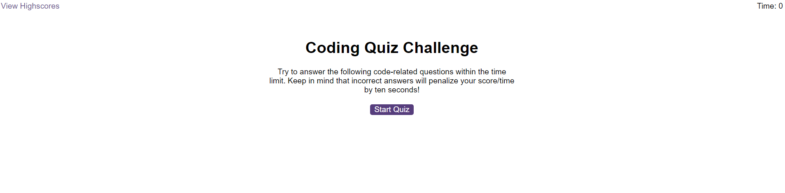

# code-quiz

## Description

 A timed quiz on JavaScript fundamentals that stores high scores

## Acceptance Criteria

GIVEN I am taking a code quiz
WHEN I click the start button
THEN a timer starts and I am presented with a question
WHEN I answer a question
THEN I am presented with another question
WHEN I answer a question incorrectly
THEN time is subtracted from the clock
WHEN all questions are answered or the timer reaches 0
THEN the game is over
WHEN the game is over
THEN I can save my initials and score

## Delpoyed Application

https://beekras.github.io/code-quiz/

## Screenshot

## Links

Some questions used from the following website: 

https://www.codeconquest.com/coding-quizzes/javascript-knowledge-quiz-beginner/ 

## License

MIT License